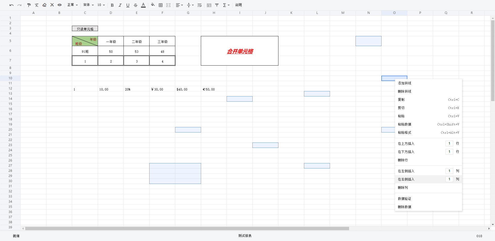

# 基于 canvas 和原生 js 的 web excel

  

## 功能列表

- 撤销、恢复
- 格式刷
- 清除单元格格式
- 清空单元格
- 删除单元格
- 单元格只读
- 单元格数据格式设置
- 字体、字号
- 字体加粗、倾斜、下划线、删除线、颜色
- 单元格填充颜色
- 边框
- 合并、拆分单元格
- 单元格水平、垂直对齐
- 单元格自动换行
- 单元格冻结
- 单元格自动筛选
- 单元格函数设置
- 单元格添加、删除斜线
- 鼠标拖动修改行高/列宽
- 右键设置行高/列宽
- 复制、剪切、粘贴
- 单元格自动填充
- 在当前单元格上/下插入指定行数或者左/右插入指定列数
- 删除行/列
- 隐藏、取消隐藏行/列
- 单元格、区域填报时隐藏
- 数据验证
- 单元格、区域多选批量操作
- 单元格支持换行输入
- 单元格高度自适应内容高度
- 允许设置受保护的单元格（受保护的单元格所在行列不允许被删除）
- 表格状态栏支持实时查看当前单元格坐标

## 浏览器支持情况

现代浏览器(Chrome, Firefox, Safari, Edge, IE10+).
